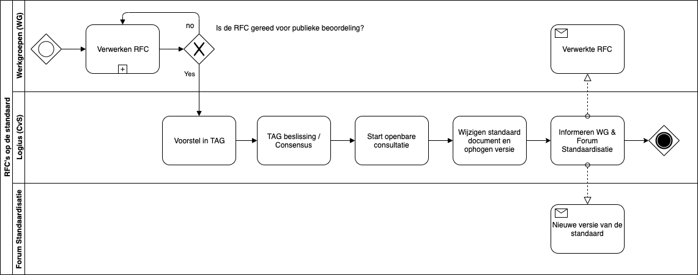

# Inleiding

## Leeswijzer

Dit document beschrijft hoe Logius, afdeling Standaarden (hierna: Logius) de OAuth NL profiel standaard beheert en hoe de bijbehorende governance is ingericht. In dit document wordt verder OAuth-NL gebruikt als afkorting voor de "NL GOV Assurance profile for OAuth 2.0" standaard.

## De NL GOV Assurance profile for OAuth 2.0 standaard kortweg OAuth-NL

De OAuth-NL standaard omvat een specifiek profiel voor het OAuth 2.0 profiel en is bedoeld om de beveiliging te verbeteren, grotere interoperabiliteit te waarborgen en bij te dragen aan een gestructureerde toepassing door Nederlandse Overheids organisaties.

De OAuth-NL is gebaseerd op het [International Government Assurance Profile (iGov) for OAuth 2.0 - Draft 03’ (Kortweg: het iGov-profile)](https://openid.net/specs/openid-igov-oauth2-1_0.html) van de "OpenID Foundation".  

### Nut

> NL GOV Assurance profile for OAuth 2.0 legt bindende afspraken vast over het gebruik van de de standaard OAuth 2.0 bij de Nederlandse overheid. In combinatie met onderliggende standaard OAuth 2.0 zorgt NL GOV Assurance profile for OAuth 2.0 ervoor dat de autorisatie van gebruikers van REST APIs van de overheid op een uniforme en eenduidige plaatsvindt
> [Bron: Forum standaardisatie](https://www.forumstandaardisatie.nl/open-standaarden/nl-gov-assurance-profile-oauth-20)

### Werking

> OAuth 2.0 is een open standaard voor de beveiliging van applicaties die gegevens uitwisselen met behulp van REST APIs. Met OAuth 2.0 kunnen gebruikers een website of webapplicatie autoriseren om hun persoonlijke gegevens via een REST API op te halen bij een ander systeem, zonder daarbij hun gebruikersnaam en wachtwoord uit handen te geven. OAuth 2.0 maakt hiervoor gebruik van ‘tokens’ die toegang geven tot specifieke gegevens van één gebruikersaccount voor een bepaalde duur.
> OAuth 2.0 is een generieke standaard die meestal nog aanvullende afspraken vereist voor de toepassing in specifieke domeinen. NL GOV Assurance profile for OAuth 2.0 legt nadere afspraken vast over het gebruik van OAuth 2.0 bij de Nederlandse overheid. Zo bepaalt NL GOV Assurance profile for OAuth 2.0 hoe applicaties zich bij elkaar moeten registreren en hoe autorisatiecodes veilig uitgewisseld moeten worden. OAuth 2.0 laat daarin namelijk nog te veel implementatieopties vrij.
> [Bron: Forum standaardisatie](https://www.forumstandaardisatie.nl/open-standaarden/nl-gov-assurance-profile-oauth-20)

### Status

De actuele versie van de OAuth-NL is v1.0. Deze versie is op 09-07-2020 door het OBDO vastgesteld op advies van het Forum Standaardisatie.  
De status van de standaard is ‘Verplicht (pas toe leg uit)’. Dit houdt kort gezegd in dat Nederlandse overheden en instellingen uit de (semi) publieke sector verplicht zijn deze standaard toe te passen op het moment dat zij REST API’s gaan gebruiken voor het ontsluiten van overheidsinformatie en/of functionaliteit naar gebruikers van websites, apps of webapplicaties. Zie voor meer informatie over het [pas toe of leg uit beleid.](https://www.forumstandaardisatie.nl/node/229)

- De verplichting is gepubliceerd door het Forum Standaardisatie op:  
<https://www.forumstandaardisatie.nl/open-standaarden/nl-gov-assurance-profile-oauth-20>
- Versie 1.0 van de OAuth-NL standaard is gepubliceerd op:  
<https://publicatie.centrumvoorstandaarden.nl/api/oauth/v1.0>
- De laatste versie van de OAuth-NL is gepubliceerd op:  
<https://publicatie.centrumvoorstandaarden.nl/api/oauth/>
- De laatste concept versie van de OAuth-NL standaard is gepubliceerd op:  
<https://logius-standaarden.github.io/OAuth-NL-profiel/>

## Bomos

Logius richt de beheerorganisatie in conform het Beheer en OntwikkelModel voor Open Standaarden (BOMOS). Ook het beheer van de OAuth-NL standaard is op basis van BOMOS ingericht. Voor de beheerorganisatie heeft Logius een generiek beheermodel opgezet, waar het beheerplan van de OAuth-NL standaard is afgeleid.  

> Figuur 1. Bomos model

Voor meer informatie over BOMOS zie ook [de beslisboom van het forumstandaardisatie](https://beslisboom.forumstandaardisatie.nl/thema/ontwikkelen-en-beheren-van-open-standaarden).  
BOMOS onderscheidt verschillende levenscyclusfases waarin een standaard zich kan bevinden. Deze fase bepaalt mede op welke beheeronderdelen meer of minder wordt ingezet. De verschillende fases zijn:  

1.	Creatie/ontwikkeling
2.	Introductie
3.	Implementatie/groei
4.	Volwaardige toepassing
5.	Uitfaseren

> Figuur 2. Bomos levenscyclus

De OAuth-NL standaard bevindt zich in de implementatie/groei fase. De eerste versie van de standaard is 16-03-2016 aangemeld bij het Forum Standaardisatie en op 09-07-2020 op de lijst van verplichte standaarden opgenomen. Vanuit verschillende overheden is samengewerkt aan de standaard en de verwachting is dat de deze standaard nog slechts beperkt ontwikkeling door gaat maken. Het gebruik en de toepassing van de OAuth-NL standaard groeit nog en is nog geen comodity bij alle overheden, hierdoor is van een volwaardige toepassing bij de beoogde doelgroep nog geen sprake.  

Dit heeft gevolgen voor het beheer van de standaard. Naast de groei in de aantallen toepassingen van de standaard is ook relevant dat eerst nog minor en major wijzigingen in de standaard op een correcte manier worden doorgevoerd en er veel informatie beschikbaar is die gebruikers helpt bij de implementatie van de standaard. Daarom is er komende tijd vooral aandacht voor:

-	Het in de praktijk bestendigen van het beheer van de standaard;  
-	Doorontwikkeling van de standaard;  
-	Groei in het aantal toepassingen van de standaard;  
-	Monitoring van het gebruik van de standaard;  
-	Groei van de community rond de standaard.  

# Strategie 

De strategische activiteiten van BOMOS bestaan uit de onderdelen Visie, Govenance en Financiering. Deze onderdelen en hun toepassing op het beheer van de OAuth-NL standaard worden hieronder beschreven.

## Visie

Met de OAuth-NL standaard wil de Nederlandse overheid de veiligheid en interoperabiliteit bevorderen. Dit komt erop neer dat overheden dezelfde standaard in vergelijkbare situaties toepassen. Dit maakt uiteindelijk dat componenten en systemen  effectief en veilig gegevens uit kunnen wisselen met de gebruikers.  
Deze doelstelling wordt onderschreven door een breed scala aan partijen die deelnemen aan het API Kennisplatform, waar de ontwikkeling van de standaard zijn oorsprong heeft, en is bestendigd door Forum Standaardisatie en het OverheidsBrede Beleidsoverhed Digitale Overheid (OBDO), die de OAuth-NL standaard hebben opgenomen op de zogenaamde ‘pas toe of leg uit’-lijst met andere standaarden die interoperabiliteit bevorderen [zie ook de basisinformatie van het Forum Standaardisatie](https://www.forumstandaardisatie.nl/basisinformatie).  

## Governance

### Governancestructuur

Bij het beheer van een open standaard hoort een open governance en een open procedure voor belanghebbenden om te kunnen participeren in het beheer. Logius, neemt hierin de rol van onafhankelijke, duurzame beheerpartij en facilitator. Bij het beheer van de OAuth-NL standaard worden verschillende gremia onderscheiden die gezamenlijk invulling geven aan de governance:  

1. OAuth community (Interesse Groep - IG)  
Dit is het meest operationele gremium waarin iedere belangstellende/belanghebbende vragen kan stellen over de OAuth-NL standaard en suggesties kan doen voor de doorontwikkeling van de standaard. Dergelijke vragen en suggesties worden door Logius verzameld en voorgelegd aan het Technisch Overleg en als issue geregistreerd in de repositorie van de standaard.  
2. Technisch Overleg (Technische Architectuur Groep – TAG)  
Het Technisch Overleg is een periodieke bijeenkomst van de Technische Architectuur Groep (TAG) waarbij de vragen en doorontwikkelwensen m.b.t. de OAuth-NL worden doorgenomen, geprioriteerd en worden uitgewerkt. Daarnaast wordt door de leden de releaseplanning en de roadmap opgesteld. Deelname aan de TAG is vrij voor eenieder die een belang heeft bij de standaard (overheid, wetenschap en markt)  
3. Tactisch overleg OAuth-NL  
Dit gremium is verantwoordelijk voor het vaststellen van de doorontwikkel-roadmap, het vaststellen van minor releases van de standaard en dient als het voorportaal van het strategisch/besluitvormende gremium: het OBDO.  
4. Het Overheidsbrede Beleidsoverleg Digitale Overheid (OBDO)  
Dit is het hoogst ambtelijke gremium dat besluit over major releases van de standaard, het beheermodel van de standaard en externe publicaties over releases en van het standaardenbeleid. Op dit moment wordt het OBDO louter ‘gevoed’ door Forum Standaardisatie en is de focus voornamelijk het bestendigen van major releases van de standaard. Op het moment dat het tactische gremium is ingevuld, zal het OBDO waarschijnlijk een breder scala aan onderwerpen langs krijgen ter bestendiging.  

> *N.B. Het tactisch overleg OAuth-NL gremium is momenteel nog niet actief, waardoor Logius bij wijzigingen aan de standaard, de nieuwe versie voorlegt aan het Forum Standaardisatie, voor het borgen van een zo breed mogelijke afstemming met verschillende belanghebbenden.*  
> *N.B. De definitieve invulling van de tactische en strategische laag (OBDO) wordt eind 2021 duidelijk.*  

In tabelvorm:  

|**Gremium**|**Accent**|**Rol participant**|**Ondersteuning door beheerder (Logius)**|
|---|---|---|---|
|**Community**   (omvang onbeperkt)|Inhoud – delen|Samen met alle leden van de Interesse Groep (IG):   1. Volgen van ontwikkelingen.   2. Leveren van input voor de doorontwikkeling van de standaard.|1. Informatie m.b.t. specificaties en beheer open delen met community.   2. Deelnemen aan  stuurgroep en werkgroepen van Kennisplatform API’s.| 
|**Technisch Overleg**  (Operationeel, 4x per jaar)|Inhoud - afstemmen| Samen met andere experts van de Technische Architectuur Groep (TAG):   1. Inhoudelijk ontwikkelen van standaard onderdelen en bijbehorende documentatie.   2. Voorbereiden van de release-planning.   3. Prioriteiten stellen voor de ontwikkeling, roadmap van nieuwe releases van de standaarden.   4. Goedkeuring van aanpassingen op de standaard.  |1. Analyseren, ontwerpen en uitwerken van specificaties.   2. Volgen en beïnvloeden van aanpalende standaarden.   3. Organiseren bijeenkomsten.   4. Opstellen en verspreiden notulen.  5. Beschikbaar stellen specificaties.|
|**Tactisch/Strategisch**  (4x per jaar)|Prioritering proces en uitwerken strategisch advies|Samen met andere participanten: 1. Vaststellen roadmap van de standaard.  2. Voorportaal OBDO.  3. Vaststellen minor releases van de standaard.|1. Analyseren, ontwerpen en uitwerken van beleidszaken, (release)planning.|  
|**OBDO**   (Strategisch besluitvormend, 2x per jaar)|Bestuurlijk besluit|Samen met andere bestuurders:  1. Vaststellen major releases van de standaard.  2.Vaststellen beheermodel van de standaard.  3. Vaststellen externe publicaties over het standaardenbeleid en releases.|1.Begeleiding van de Adviesraad en inbreng via secretariaat OBDO.  2. Publiceren standaarden en andere Standaard-informatie.|
> Figuur 3. Overheidsbreed Beleidsoverleg Digitale Overheid

### Besluitvorming 

In alle overleggremia vindt besluitvorming plaats op basis van consensus. Mocht consensus niet mogelijk zijn, dan gaat het vraagstuk met een weergave van de verschillende standpunten door naar het eerstvolgend-hoger gelegen-gremium. Indien in het hoogste gremium (het OBDO) geen consensus bereikt kan worden, heeft de voorzitter van het OBDO (min. BZK) de beslissende stem.  

### Deelname

Uitbreidingen en aanpassingen in de standaard komen tot stand door participatie van de verschillende belanghebbenden. Belanghebbenden kunnen op vier manieren participeren aan het wijzigings- en besluitvormingsproces:  

1. Als lid van de Community van het Kennisplatform / de Interesse Groep (IG)  
2. Als lid van de Technische Architectuur Groep (TAG)  
3. Als lid van het Tactisch overleg  
4. Als lid van het OBDO

*Ad 1) Deelname aan de Community staat open voor alle belanghebbenden;*  
*Ad 2) Invulling van het Tactisch overleg volgt, zodra bekend is welk gremium dit is;*  
*Ad 3) Het OBDO kent een vaste vertegenwoordiging. [Zie voor meer informatie de governance van Digitaleoverheid.nl](https://www.digitaleoverheid.nl/governance-digitale-overheid/).*  
*Ad 4) Aangezien het overleg van de Technische Architectuur Groep (het Technisch Overleg) het eerste besluitvormende gremium is van de standaard, en besluitvorming in dit gremium plaatsvindt op basis van consensus, stelt Logius een aantal voorwaarden aan deelname:*  

   1. Leden van het technisch overleg dienen een aantoonbaar belang te hebben bij de standaard.
   2. De omvang en samenstelling moet een goede vertegenwoordiging bevatten van de verschillende belangen rond de standaard. We gaan uit van 1 deelnemer per organisatie.
   3. Het belang van de Nederlandse overheid dient voldoende geborgd te zijn in het technisch overleg.

Personen/partijen die willen deelnemen aan het technisch overleg kunnen een mail sturen aan api@logius.nl, waarin zij aangeven wat hun belang is bij de standaard. Met inachtneming van bovenstaande punten, beoordeeld Logius de aanvraag.

## Financering

Het beheer van de standaard wordt gefinancierd door min. BZK voor een initiële periode van tenminste drie jaar (2020-2023) om gebruikers het vertrouwen te geven dat er geen desinvesteringen worden gedaan bij het implementeren van de standaard. Na drie jaar wordt de financiering verlengd als blijkt dat het nut van en de behoefte aan de standaard nog aanwezig is.  

# Tactiek

## Community

De community / Interesse Groep bestaat uit eenieder die belanghebbende of belangstellende is m.b.t. de standaard. Deelname aan de community kent geen drempels of restricties. Leden van de community kunnen alle informatie m.b.t. de standaard en het beheer daarvan inzien via de website en via verschillende kanalen issues of RFC&#39;s melden. Daarnaast kunnen community leden reageren op openbare consultaties en onder bepaalde voorwaarden deelnemen aan de Technische Architectuur Groep (zie 2.2.3).

## Architectuur

De standaard is een op zichzelf staande standaard en geen onderdeel van een bovenliggende standaard. Wel wordt er in de OAuth-NL verwezen naar verschillende andere (internationale) standaarden.

### Internationale, Europese en nationale standaardisatiegemeenschap

De standaard volgt de ontwikkeling van internationale standaarden (zoals bijvoorbeeld de HTTP standaarden van het IETF) in het algemeen. Meer specifiek volgen de specialisten van Logius en de leden van de TAG de standaarden waarnaar wordt gerefereerd in de standaard en bespreken deze ontwikkelingen ook in het Technisch Overleg. Indien relevant worden op basis van de internationale ontwikkelingen rfc&#39;s opgesteld om de OAuth-NL standaard aan te passen, verbeteren of actualiseren. Enkele bekende standaarden waarnaar wordt verwezen zijn:

1. iGov-NL
1. OAuth 2.0
1. HTTP
1. TLS
1. JSON
1. JWS
1. JWE
1. JWK Set
1. JWT
1. PKCE
1. PKIOverheid
1. OIDC

> Een volledige lijst van alle referenties is beschikbaar in de standaard. Zie hiervoor de [Bijlage A. References](https://publicatie.centrumvoorstandaarden.nl/api/oauth/#references)

### Samenwerking met andere beheerorganisaties

#### Kennisplatform API&#39;s

Kennisplatform API&#39;s is een initiatief van Geonovum, Bureau Forum Standaardisatie, Kamer van Koophandel, VNG Realisatie en Logius. Het doel van het Kennisplatform is om de kennis over het toepassen van API&#39;s uit te wisselen en de aanpak bij verschillende organisaties op elkaar af te stemmen en waar nodig te standaardiseren. In het kennisplatform wordt gezamenlijk gekeken naar strategische en tactische vraagstukken rond het ontwikkelen van API&#39;s door de overheid en gebruik van deze API&#39;s buiten en binnen de overheid. Dit vanuit de gedachte dat we in een digitale samenleving eenvoudig met elkaar moeten kunnen samenwerken.  

Het opstellen van de OAuth-NL standaard is voortgekomen uit het [Expert advies OAuth 2.0](https://www.forumstandaardisatie.nl/sites/bfs/files/Expertadvies%20OAuth%202.0.pdf). Daarin wordt aangeraden eerst een nederlands profiel op stellen alvorens OAuth op de pas toe of leg uit lijst van het forum standaardisatie te plaatsen. Het maken van dit Nederlandse profiel is opgepakt door de werkgroep Authenticatie/Autorisatie van het Kennisplatform API's.

#### Nederlandse Overheid Referentie Architectuur (NORA)  

De standaard volgt de principes van de Nederlandse Overheid Referentie Architectuur. Zie voor meer informatie: [https://www.noraonline.nl/wiki/NORA\_online](https://www.noraonline.nl/wiki/NORA_online)  

In de NORA is sinds 2017 het [Thema IAM](https://www.noraonline.nl/wiki/Identity_%26_Access_Management_(IAM)) opgenomen en beschreven. De NORA beschrijft met name wat Identity and Access Management (IAM) is en waarom het belangrijk zijn. Ook zijn er op de site aanbevelingen voor IAM in de Enterprise Architectuur en de toepassing van IAM in het ontwerp van een dienst.

#### Overige belangrijke vermeldingen (zoals overlap met andere standaarden)  

_API Design Rules - ADR (pas toe of leg uit standaard)_

De API Design Rules beschrijven zoals gezegd een set van richtlijnen om REST API&#39;s vorm te geven en toe te passen. Deze standaard is gepubliceerd op [Logius-standaarden/API-Design-Rules (github.com)](https://github.com/Logius-standaarden/API-Design-Rules).

_Haal Centraal &amp; Common Ground (VNG)_

Hoe API&#39;s daadwerkelijk dienen te functioneren en welke generieke, specifieke en meta functies API&#39;s moeten omvatten wordt o.a. door VNG gestandaardiseerd in de Haal Centraal initiatieven.

Een lijst van API&#39;s die in ontwikkeling zijn is te vinden op [VNG Realisatie (github.com)](https://github.com/VNG-Realisatie) Ook is er een belangrijk initiatief vanuit VNG Realisatie wat een drijvende kracht is achter de gezamenlijke ontwikkeling van standaard API&#39;s genaamd [Common Ground](https://commonground.nl/). Vanuit dit initiatief zijn standaard API voorzieningen ontwikkeld zoals een [Developer portaal voor de overheid](https://developer.overheid.nl/) en het [API Test Platform (api-test.nl)](https://api-test.nl/)

## Rechtenbeleid  

De OAuth-NL standaard zelf en dit beheermodel vallen onder de Creative Commons licentie ([Creative Commons Attribution 4.0 License](https://creativecommons.org/licenses/by/4.0/)) Dit houdt in dat het is toegestaan om deze documenten te gebruiken, verder te verspreiden en aan te passen. Dit werk en de specificaties van de OAuth-NL standaard worden royalty-free ter beschikking gesteld. Organisaties en personen die bijdragen aan de OAuth-NL dienen dit onder dezelfde voorwaarden te doen als bij het originele werk. Door bij te dragen aan de OAuth-NL standaard verklaren zij hiermee in te stemmen.

Uitgesloten van alle bovenstaande zijn rechten verbonden aan de standaarden, profielen en andere onderdelen waar de OAuth-NL standaard gebruik van maakt. Hierop zijn de rechten van de betreffende standaarden, profielen en andere onderdelen zelf van toepassing. Dit zijn in geval van de OAuth-NL allemaal open standaarden.

## Kwaliteitsbeleid en benchmarking  

Zoals gezegd wordt het beheer van de OAuth-NL standaard volledig open ingevuld (zie ook 1.3 en 2.2.) Dit borgt dat zoveel mogelijk belangstellenden en belanghebbenden betrokken zijn bij wijzigingen en besluitvorming die wijzigingen.

## Adoptie en erkenning  

De OAuth-NL standaard heeft de &#39;pas toe of leg uit&#39; -status van Forum Standaardisatie. Dit betekent kort gezegd dat Nederlandse overheidspartijen en partijen uit de (semi) publieke sector deze standaard dienen toe te passen op het moment dat zij hun informatie met behulp van (OAuth) API&#39;s willen ontsluiten. Zie hoofdstuk 1 voor meer informatie.

# Operationeel

## Initiatie

1. Uitbreidingen en aanpassingen in de OAuth-NL Standaard komen tot stand door participatie van de verschillende belanghebbenden.
2. Belanghebbenden kunnen op vier manieren participeren: als lid van de Community en/of de Technische Architectuur Groep en/of als lid van de Adviesraad of als lid van het OBDO.

## Wensen en Eisen

RFC&#39;s kunnen binnen komen via verschillende kanalen:

1. Rechtstreeks bij Logius, tijdens overleggen, via de website of mail
2. Bij de werkgroep Security van het Kennisplatform API&#39;s, tijdens overleggen, via de website of mail

RFC&#39;s worden als issue&#39;s geregistreerd in de repository van de OAuth-NL standaard op Github. [https://github.com/Geonovum/KP-APIs/issues](https://github.com/Geonovum/KP-APIs/issues) of direct in de repository van de OAuth-NL standaard op Github [https://github.com/Logius-standaarden/OAuth-NL-profiel/issues](https://github.com/Logius-standaarden/OAuth-NL-profiel/issues)

> Figuur 5. OAuth-NL RFC Procesmodel

## Uitvoering en ontwikkeling (Wijzigingsproces)

De procedure van RCF naar daadwerkelijke wijziging ziet er als volgt uit:

- Issues die in behandeling worden genomen worden als RFC gelabeld.
- RFC&#39;s worden besproken en uitgewerkt in de Werkgroep.
- RFC&#39;s worden vastgesteld in Technisch Overleg&#39;s (TO).
- RFC worden na vaststelling in het TO Openbaar geconsulteerd
- Na vaststelling volgt publicatie van de nieuwe versie van standaard

> N.B. Zolang het Centrum voor Standaarden nog geen predicaat &quot;Uitstekend beheer&quot; heeft ontvangen van Forum Standaardisatie, zullen nieuwe versies na vaststelling in het TO aan Forum Standaardisatie worden voorgelegd ter beoordeling.  
> N.B.2. Het technisch overleg is momenteel samengevoegd met het structurele overleg van de werkgroep security van het Kennisplatform (zie 2.2.3)

Dit is schematisch weergegeven in het onderstaande governance model:  

> Figuur 6. OAuth-NL Governance model

## Status van de standaard

Logius, Centrum voor standaarden onderscheid vier statussen die de OAuth-NL standaard kan hebben:

| **Afkorting**|**Status van de standaard**|**Beschrijving van de status** |
| --- | --- | --- |
| IO | In Ontwikkeling | Een nieuwe release van de standaard is &quot;In Ontwikkeling&quot; wanneer er met medeweten en medewerking van participanten aan gewerkt wordt en wanneer dit onderdeel of deze release nog niet voor de buitenwereld is gepubliceerd. |
| IG | In Gebruik | Als een nieuwe release van de standaard gereed is, en is bestendigd door Forum Standaardisatie, stelt het Technisch Overleg de status &#39;In Gebruik&#39; vast. Door deze vaststelling worden gebruikers en ICT-leveranciers opgeroepen deze nieuwe release op te nemen in software en in gebruik te nemen. |
| EO | Einde Ondersteuning | De standaardversie met de status &quot;Einde ondersteuning&quot; wordt niet meer ondersteund door de beheerder. De kennis en informatie voor vragen en support is bij de beheerder niet langer beschikbaar. |
| TG | Teruggetrokken | De standaard krijgt de status &quot;Teruggetrokken&quot; indien een release van de standaard niet bruikbaar blijkt (bijv. vanwege implementatieproblemen). |

> Figuur 7. Mogelijke statussen van de standaard

## Documentatie

Alle documenten m.b.t. de standaard en het beheer van de standaard worden openbaar en zonder drempels voor gebruik, gepubliceerd op logius.nl en onze Github pagina&#39;s. Logius publiceert tenminste de volgende documenten:

- Dit OAuth-NL beheermodel
- De vergaderstukken van het Technisch overleg en overige besluitvormende gremia.
- De specificaties van de standaard
- De voorlopige specificaties van de nieuwe versie van de standaard.

Versie 1.0 van de OAuth-NL is gepubliceerd op: 
[https://publicatie.centrumvoorstandaarden.nl/api/oauth/v1.0](https://publicatie.centrumvoorstandaarden.nl/api/oauth/v1.0)

De laatste versie van de OAuth-NL is gepubliceerd op: 
[https://publicatie.centrumvoorstandaarden.nl/api/oauth/](https://publicatie.centrumvoorstandaarden.nl/api/oauth/)

De laatste concept versie van de standard is gepubliceerd op: 
[https://logius-standaarden.github.io/API-Design-Rules/](https://logius-standaarden.github.io/API-Design-Rules/)

Het beheermodel is gepubliceerd op: 
[Logius-standaarden/OAuth-Beheermodel (github.com)](https://github.com/Logius-standaarden/OAuth-Beheermodel)

De vergaderstukken zijn gepubliceerd op: 
[Logius-standaarden/OAuth-Beheermodel/vergaderstukken (github.com)](https://github.com/Logius-standaarden/OAuth-Beheermodel/tree/main/vergaderstukken)

# Implementatieondersteuning

## Opleiding en advies

Logius biedt momenteel geen opleiding aan, maar borgt dat de informatie m.b.t. de standaard altijd, zonder drempels, toegankelijk is. Bovendien kunnen geïnteresseerden via verschillende kanalen contact opnemen met Logius in geval van vragen of opmerkingen. Zie hiervoor 5.2 Helpdesk.  
Aanvullend organiseert Kennisplatform API&#39;s regelmatig overleggen en seminars m.b.t. de Nederlandse API Strategie waar de OAuth-NL standaard een onderdeel van is. Zie hiervoor [www.apigov.nl](http://www.apigov.nl/).

## Helpdesk

Logius biedt ondersteuning en advies via verschillende kanalen:
- Online: als reactie op issue&#39;s in de Github van het Kennisplatform: 
[Issues · Geonovum/KP-APIs (github.com)](https://github.com/Geonovum/KP-APIs/issues)
- Per mail: [api@logius.nl](mailto:api@logius.nl)
- Telefonisch: 0900 - 555 45 55
- Per post: Logius, Postbus 96810; 2509 JE Den Haag, (t.a.v. CvS).

## Validatie &amp; Certificatie

Certificatie van API&#39;s is op dit moment niet mogelijk. Wel is het mogelijk API&#39;s op basis van de Design Rules te valideren en te testen met behulp van de door VNG gerealiseerde tools welke beschikbaar zijn op:

- [Developer.overheid.nl](https://developer.overheid.nl/) &amp;
- [API-test.nl](https://api-test.nl/)  

Na validatie met de API-test tool is het mogelijk een badge te genereren waarmee aangetoond wordt dat de API voldoet aan alle test voorwaarden.

# Communicatie

## Promotie

De OAuth-NL standaard wordt via verschillende kanalen gepromoot. Ten eerste via het Kennisplatform API&#39;s als onderdeel van de Nederlandse API-strategie. Naast communicatie op de website van het kennisplatform, organiseert het platform regelmatig vrij toegankelijke bijeenkomsten.  
Daarnaast heeft de standaard de zogenaamde &#39;pas toe of leg uit&#39; -status van Forum Standaardisatie. Dit betekent dat Forum Standaardisatie het gebruik van deze standaard niet alleen actief promoot, maar in veel gevallen zelfs hard voorschrijft.  
Tot slot is Logius promotor van de standaard. Zowel intern voor de toepassing van de standaard in Logius voorzieningen als extern, door andere partijen te informeren en adviseren over de mogelijkheden van de standaard.

## Publicatie

Als een nieuwe versie van de OAuth-NL standaard de status "In Gebruik" heeft, worden verschillende zaken gepubliceerd.  
Logius publiceert altijd de volledige specificatie van de standaard op een deel van zijn website. Daarnaast wordt een persbericht uitgegeven, waarin de publicatie van de nieuwe release van de standaard wordt aangekondigd.  
Aanvullend publiceert Logius alle genoemde documentatie zoals genoemd bij 4.5.

## Klachtenafhandeling

Klachten over de opzet of de uitvoering van het beheerproces kunnen ingediend worden bij Logius. Dit kan in principe via alle beschikbare kanalen. De indiener van de klacht krijgt zo spoedig mogelijk en altijd terugkoppeling over de voortgang van en beslissing over zijn klacht.  
De volledige klachtenprocedure is terug te vinden in het generieke beheermodel van Logius, afdeling standaarden. (volgt)
